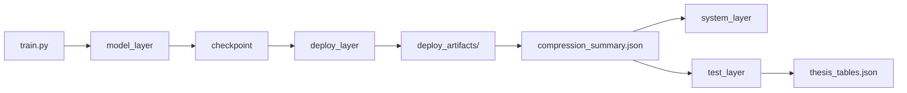

# 工业物联网下基于元学习的边缘设备少样本故障诊断系统

Few-Shot Fault Diagnosis System for Edge Devices Based on Meta-Learning in Industrial Internet of Things

**摘要：** 工业设备跨工况故障诊断面临两方面困难：目标工况标注样本稀缺，且不同工况之间振动信号的数据分布存在明显偏移。本文针对上述问题，基于少样本学习构建面向边缘部署的故障诊断方法与系统。基于凯斯西储大学（Case Western Reserve University，CWRU）数据集，在统一 5-way K-shot 任务设定下，引入快速傅里叶变换（Fast Fourier Transform，FFT）、短时傅里叶变换（Short-Time Fourier Transform，STFT）和小波变换（Wavelet Transform，WT）三种预处理方式，对 CNN、MAML 与 ProtoNet 三类模型进行受控比较，并设计涵盖结构化剪枝、恢复训练、ONNX 导出和 INT8 量化的五阶段部署流程。实验结果表明，WT 和 STFT 的整体识别效果优于 FFT，FFT 的部署推理时延更低；在主实验矩阵中，ProtoNet 整体表现优于 MAML 与 CNN；在固定 STFT 条件下的多随机种子补充实验中，ProtoNet 与 MAML 均保持 99% 以上平均准确率，10-shot 设置在 MAML 上表现出较好的准确率与稳定性平衡。本文基于 FastAPI、WebSocket、MQTT 和前端可视化界面实现了在线诊断系统，完成压缩模型的部署与在线推理验证；在 direct 通道下，系统平均预处理时延为 56.238 ms，平均推理时延为 0.905 ms，平均端到端时延为 57.258 ms。从实验结果来看，少量支持样本条件下的跨工况故障识别是可行的，经压缩与格式转换后的部署工件可直接接入在线推理服务，从训练到在线调用的链路在所用软硬件环境下经过了实际运行验证。

**关键词：** 少样本故障诊断；元学习；跨工况泛化；边缘部署；模型压缩

**Abstract:** Cross-condition fault diagnosis of industrial equipment faces two persistent difficulties: labeled samples in the target working condition are typically scarce, and vibration signal distributions shift substantially across conditions. This paper builds a few-shot fault diagnosis framework for edge deployment and evaluates it on the CWRU bearing dataset under a unified 5-way K-shot setting.

Three model families are compared—CNN, Model-Agnostic Meta-Learning (MAML), and Prototypical Networks (ProtoNet)—across three input representations: Fast Fourier Transform (FFT), Short-Time Fourier Transform (STFT), and Wavelet Transform (WT). A five-stage deployment pipeline covers structured pruning, recovery fine-tuning, ONNX export, and INT8 post-training quantization.

WT and STFT consistently outperform FFT on diagnostic accuracy, while FFT runs faster at inference. Across the 27-combination main experiment matrix, ProtoNet ranks highest overall. In supplementary multi-seed runs fixed to STFT, both ProtoNet and MAML maintain average accuracy above 99%, and the 10-shot setting yields the best accuracy-stability trade-off for MAML. An online diagnostic system built on FastAPI, WebSocket, MQTT, and a browser dashboard completes end-to-end inference under the direct channel with an average preprocessing latency of 56.238 ms, inference latency of 0.905 ms, and end-to-end latency of 57.258 ms. Compressed models exported from offline training load directly into the live service without manual conversion steps.

**Keywords:** Few-shot Fault Diagnosis; Meta-Learning; Cross-Condition Generalization; Edge Deployment; Model Compression

## 第1章 引言

### 1.1 研究背景与意义

工业设备故障诊断是实现预测性维护和保障生产连续运行的重要基础，其中旋转机械轴承作为关键易损部件，其运行状态直接影响整机的可靠性与安全性。与实验室条件下的固定工况诊断不同，工业现场中的负载、转速、安装条件及运行环境常发生变化，导致振动信号的频谱结构、能量分布和局部冲击特征产生明显差异，这就是工业现场中普遍存在的跨工况分布偏移问题。已有综述研究表明，基于深度学习的故障诊断方法在标准数据集和固定工况条件下已取得较好效果，但当训练工况与目标工况不一致时，模型性能仍容易显著下降。因此，如何在工况变化条件下保持稳定识别能力，已成为智能故障诊断研究中的关键问题之一。

除分布偏移外，工业故障诊断还普遍面临目标工况标注样本稀缺的问题。新设备投运、罕见故障出现或工况切换初期，往往难以快速获得足量标注数据，使依赖大规模监督训练的传统深度模型难以直接迁移到目标场景。为解决"少量标注样本 + 分布变化"并存的难题，少样本学习和元学习逐渐被引入故障诊断领域。以模型无关元学习（Model-Agnostic Meta-Learning，MAML）为代表的梯度式元学习方法，通过学习易于适配新任务的初始化参数，实现少量样本下的快速更新；以原型网络（Prototypical Networks，ProtoNet）为代表的度量式方法，则通过构造类别原型并执行距离判别完成快速推理。这类方法更符合工业现场标注样本稀缺的实际约束，为跨工况故障诊断提供了新的建模思路。

另一方面，工业物联网与边缘计算的发展，使故障诊断研究不再只停留于离线精度比较，而逐渐转向"能否在资源受限环境中稳定运行"的工程问题。这意味着，面向工业现场的故障诊断方法不仅需要在少样本条件下保持较高识别性能，还应兼顾模型体积、推理时延和在线服务可运行性。仅报告离线准确率，已不足以完整说明方法的实际应用价值。

基于上述背景，本文聚焦工业设备跨工况少样本故障诊断问题，在统一 5-way K-shot 任务设置下，对卷积神经网络（CNN）、MAML 和 ProtoNet 三类方法进行受控比较，并将 FFT、STFT 和 WT 三种信号表示纳入同一实验框架；同时引入结构化剪枝、恢复训练、ONNX 导出与 INT8 量化，完成面向在线调用的部署验证。研究着力点体现在两个方面：在方法层面，将少样本诊断方法比较、信号表示分析与边缘部署验证纳入统一实验框架，以期厘清不同学习机制与输入表示之间的适配关系；在工程层面，将离线实验所得模型通过压缩部署链路转化为可在线调用的服务，为少样本故障诊断方法在边缘环境中的应用提供可追溯的验证依据。

### 1.2 国内外研究现状

基于深度学习的故障诊断方法方面，现有工作已从依赖人工特征的传统模式识别方法，逐步转向以卷积神经网络为代表的端到端特征学习方法。这类方法能够直接从振动信号的时域序列或时频图像中提取判别特征，在标注充足、工况固定的条件下取得了较好的诊断效果[4]。然而，现有深度诊断模型普遍依赖大量标注样本，且通常针对特定工况进行优化；当训练工况与目标工况存在明显分布偏移时，模型在目标域的识别性能往往下降[12]，难以直接应对工业现场中工况多变、标注稀缺的实际约束。

基于少样本学习的故障诊断方法方面，现有研究逐步将 N-way K-shot 任务式学习框架引入故障诊断问题，以适应目标工况标注样本极少的场景。现有工作表明，在合理任务构造下，少样本方法能够在支持样本有限的条件下完成较为准确的故障类别判别，相比固定监督训练具有更好的新工况适配能力[2] [3]。但现有研究大多聚焦于单类方法的性能验证，梯度式与度量式方法的系统横向比较、不同信号表示对识别效果的影响分析，以及在不同随机设置下结果一致性的验证，均缺乏统一实验框架的支撑[13]。

元学习方法在故障诊断中的应用方面，MAML 和 ProtoNet 是目前被较多引入故障诊断的代表性方法。MAML 的训练目标是找到一组对新任务快速适配的初始参数[7]；ProtoNet 则通过学习嵌入空间中的类别原型，利用支持样本均值与查询样本距离完成无需梯度更新的快速推理[1]。现有研究通常在特定数据集和固定任务划分下分别验证两类方法[2] [5]，较少在统一受控设置下进行横向比较，且对不同信号表示与不同学习机制之间联动影响的分析不足，不同工况划分下跨域泛化稳定性的讨论也较为有限。

在面向边缘部署的模型压缩与轻量推理研究中，已有方法通常采用参数剪枝、低比特量化和模型蒸馏等手段，以在尽量保留识别精度的同时压缩模型规模、降低推理时延[15] [16]。但相关研究多停留在压缩算法评估[14]，较少说明压缩后的模型怎样接入在线预处理、推理后端与监控模块，也缺少部署工件进入在线服务链路后的端到端工程验证[6]。

综上，现有研究在方法系统比较、信号表示分析与在线部署验证三方面仍存在一定不足，本文从上述问题出发展开研究。

### 1.3 本文主要工作

针对上述不足，本文在统一的 5-way K-shot 框架下，将三类模型、三种信号表示与压缩部署验证整合于同一实验体系，从准确率、稳定性、跨域泛化和部署代价四个维度展开比较分析。具体地，本文完成以下四项工作：

（1）建立统一的少样本学习实验框架，在相同的 5-way K-shot 任务设置下，比较监督式 CNN、MAML 和 ProtoNet 三类模型，并将 FFT、STFT 和 WT 三种信号表示方式纳入同一实验流程，形成"3 种预处理 × 3 类模型 × 3 种 shot 设置"共 27 组主实验矩阵，进而分析模型机制与输入表示之间的适配关系。

（2）基于凯斯西储大学（Case Western Reserve University，CWRU）轴承数据集，在主实验结果之外，引入多随机种子稳定性分析和四种跨域留出目标工况划分（012→3、013→2、023→1、123→0），从准确率均值、标准差和跨域泛化能力三个维度验证方法的鲁棒性，提供具有可复现性的实验依据。

（3）围绕训练结果向部署工件转化这一工程目标，将结构化剪枝、恢复训练、ONNX 导出和 INT8 量化纳入完整部署链路，通过统一的压缩摘要文件连接训练结果、部署产物与论文结论，保证三个阶段之间具有可追溯的对应关系。

（4）构建基于 FastAPI 后端、WebSocket 实时推送、消息队列遥测传输（Message Queuing Telemetry Transport，MQTT）协议接入和前端可视化控制台的在线诊断系统，完成部署模型在 direct 通道下的系统闭环验证，报告在线预处理时延、推理时延与端到端时延，说明离线实验结果向在线推理服务转化的可行性。

上述工作的贡献主要体现在两个方面。一方面，本文以 `compression_summary.json` 等结果文件为关键证据，将离线训练、模型压缩、在线推理服务和论文表格生成连接到同一工程链路中，使实验结果、部署产物和论文结论之间能够相互核对，减少人工整理带来的误差。另一方面，本文在统一的任务设置下比较 CNN、MAML 和 ProtoNet 三类学习机制，以及 FFT、STFT 和 WT 三种信号表示方式，并补充多随机种子稳定性验证和多工况域划分实验，为后续结果分析提供了较完整的实验依据。

### 1.4 论文结构安排

第2章介绍本文涉及的理论与方法基础，主要包括少样本学习任务定义、MAML 与 ProtoNet 的基本原理，以及 FFT、STFT 和 WT 三种信号表示方法。第3章围绕系统总体设计展开，说明六层架构及各模块之间的数据流、控制流关系。第4章进一步给出少样本故障诊断方法与边缘部署方案，内容包括任务构造、模型设计和压缩部署流程。第5章对实验设计与结果进行分析，涵盖主实验矩阵、多 seed 稳定性、跨域泛化能力和压缩消融实验。第6章说明系统实现与在线验证过程，给出部署链路的运行配置和系统性能结果。第7章总结全文工作，并分析当前研究的不足与后续展望。

## 第2章 相关理论与方法基础

### 2.1 少样本学习与任务式组织

少样本学习针对目标类别标注样本极少时仍需完成分类的问题。在工业设备故障诊断中，新设备投运或工况变化往往导致目标域标注数据十分有限；若仍沿用依赖大规模数据的监督学习框架，模型在目标域的适配能力通常难以满足实际需求。少样本学习的核心思路是：不在某一固定数据分布上穷举优化，而是通过多任务训练构建跨任务泛化能力，使模型在样本极少时仍能完成有效判别。

本文采用 N-way K-shot （N 个类别、每类 K 个支持样本）任务式组织方式。每个任务 $\mathcal{T}$ 包含支持集 $\mathcal{S}$ 和查询集 $\mathcal{Q}$：
$$
\begin{equation}
\mathcal{T}=(\mathcal{S},\mathcal{Q}),
\quad
\mathcal{S}=\{(x_i^{s},y_i^{s})\}_{i=1}^{N\times K},
\quad
\mathcal{Q}=\{(x_j^{q},y_j^{q})\}_{j=1}^{M}
\end{equation}
$$
支持集提供当前任务的少量先验信息，查询集用于评估模型在该任务上的判别能力。训练阶段通过反复采样不同任务，使模型学习"如何在少量支持样本下适应新任务"，而非针对固定类别的静态映射。这种任务形式更贴近故障诊断实际场景：目标工况下仅有少量已标注样本，但类别判别仍须完成。本文代码中，`ways`、`shots`、`query_shots` 直接对应上述参数，支持集与查询集的划分逻辑在训练、测试和部署三个阶段保持统一，是第4章方法设计与评价指标定义的直接基础。

工业振动信号中的样本稀缺问题往往伴随跨工况分布偏移。旋转机械在不同转速、负载条件下，信号的幅值尺度、频率成分及局部冲击特征均会发生变化，使源工况与目标工况之间存在一定的统计分布差异，导致源域所学判别特征在目标工况下出现不同程度的偏移。N-way K-shot 任务式框架在建模上同时考虑了样本稀缺与分布变化两方面约束，与工业故障诊断场景的实际情况较为契合。

### 2.2 模型无关元学习（MAML）

MAML是一种基于梯度优化的元学习方法[7]，其目标是在多个任务上学习一组"易于快速适配"的初始参数。与直接针对某一训练集最小化分类误差不同，MAML 关注参数初值对新任务的可迁移性：给定少量支持样本，只需少步梯度更新，模型就应在新任务上取得可用性能。

对任意任务 $\mathcal{T}_i$，MAML 先在支持集 $\mathcal{S}_i$ 上执行内循环更新，得到任务相关参数：
$$
\begin{equation}
\theta_i'
=
\theta-\alpha
\nabla_{\theta}
\mathcal{L}_{\mathcal{S}_i}(f_{\theta})
\end{equation}
$$
其中 $\theta$ 为元参数，$\alpha$ 为内循环学习率，$\mathcal{L}_{\mathcal{S}_i}$ 为第 $i$ 个任务的支持集上的交叉熵损失。随后，以查询集损失评估适配结果，并将梯度反传至元参数，对初始参数进行更新：
$$
\begin{equation}
\theta
\leftarrow
\theta-\beta
\nabla_{\theta}
\mathcal{L}_{\mathcal{Q}_i}(f_{\theta_i'})
\end{equation}
$$
其中 $\beta$ 为外循环学习率，$\mathcal{L}_{\mathcal{Q}_i}$ 表示查询集损失。外循环优化的是能够在多个任务上快速迁移的共享初始化，而非某一任务的最终参数。在多步内循环情形下，模型重复执行支持集梯度更新，并以最终适配后的参数在查询集上的损失作为元优化依据。完整的任务采样、支持集适配与查询集元优化过程见算法1。

MAML 的核心优势在于保留参数层面的可塑性，而非构造固定类别原型。只要新任务仍符合训练阶段见过的任务结构，模型就可以借助支持集梯度迅速修正决策边界。从机制上看，MAML 并不直接构造固定类别原型，而是学习一组便于新任务快速更新的参数初值。只要目标任务与元训练任务具有相近的任务结构，模型即可利用支持集梯度在有限步内修正决策边界。本文后续的 MAML 方案基于这一思想组织任务采样、支持集适配与查询集评估，具体实现参数与部署适配流程见第4章。部署阶段，模型接收目标工况少量支持样本后执行有限步适配，无需重新优化全部权重，这是第4章 MAML 部署方案的核心前提。

### 2.3 原型网络（ProtoNet）

原型网络（Prototypical Networks，ProtoNet）是一种基于度量学习的少样本分类方法[1]，其核心在于用支持集样本的嵌入均值表示类别中心，并依据查询样本与各类别中心之间的距离完成分类。与 MAML 依赖梯度适配不同，ProtoNet 在新任务中通常不更新全部模型参数，而是通过重新计算类别原型完成快速决策。该方法隐含的假设是：经过编码器映射后，同类样本在嵌入空间中相对集中，不同类别之间保持可分距离。

设编码器为 $f_\phi$，第 $k$ 类支持集为 $\mathcal{S}_k$，类别原型定义为：
$$
\begin{equation}
\mathbf{c}_k
=
\frac{1}{|\mathcal{S}_k|}
\sum_{(x_i,y_i)\in \mathcal{S}_k}
f_{\phi}(x_i)
\end{equation}
$$
其中，$\mathbf{c}_k$ 表示第 $k$ 类在嵌入空间中的中心表示。对于任一查询样本 $x$，可根据其嵌入 $f_\phi(x)$ 与各类别原型之间的距离计算分类概率和预测类别：
$$
\begin{equation}
p_{\phi}(y=k|x)
=
\frac{
\exp\left(-d(f_{\phi}(x),\mathbf{c}_k)\right)
}{
\sum\limits_{k'}
\exp\left(-d(f_{\phi}(x),\mathbf{c}_{k'})\right)
}
\end{equation}
$$
其中，$d(\cdot)$ 为嵌入空间距离，本文实现以欧氏距离的负值作为分类 logit，预测时，模型选取上述概率最大的类别作为查询样本的诊断结果，完整的 episode 推理流程见算法2。从判别机制看，原型网络依赖一个核心假设：同类样本在嵌入空间中分布相对集中，使得类别均值能够有效代表该类。对于故障诊断任务而言，这一设定具有合理的物理基础——同一故障类型虽因工况、转速或负载变化而呈现局部差异，但主要的故障特征成分在合适的嵌入映射下仍倾向于保持聚类趋势。实际实现中，编码器同时前向传播支持集与查询集，按类平均形成原型后，直接依据查询嵌入与各原型间的距离输出分类概率。

### 2.4 振动信号预处理方法

振动信号的表示方式直接决定模型的输入形态与特征提取路径，与学习算法的选取同等重要。本文选取FFT、STFT和WT三种方法，分别构造一维频谱输入和二维时频图输入，统一纳入受控对比实验，以系统分析不同信号表示对少样本故障诊断效果的影响。

FFT 将时域序列映射至频域，得到各频率成分的幅值分布[8]：
$$
\begin{equation}
X[k]
=
\sum_{n=0}^{N-1}
x[n]e^{-j\frac{2\pi}{N}kn},
\quad
k=0,1,\dots,N-1
\end{equation}
$$
STFT 在时域滑动窗口内逐段计算频谱，保留局部时频结构：
$$
\begin{equation}
\mathrm{STFT}_{x}(m,\omega)
=
\sum_{n=-\infty}^{+\infty}
x[n]\,w[n-m]\,e^{-j\omega n}
\end{equation}
$$
WT 通过尺度与平移参数实现多分辨率分析，对非平稳信号的局部瞬态成分更为敏感：
$$
\begin{equation}
W_{x}(a,b)
=
\frac{1}{\sqrt{|a|}}
\int_{-\infty}^{+\infty}
x(t)\,
\psi^{*}\!\left(\frac{t-b}{a}\right)\,dt
\end{equation}
$$
三种方法各有侧重：FFT 反映全局频率分布，适合表征工况稳定时的周期性故障成分；STFT 同时保留时间与频率信息，适合观察故障特征随时间的局部演化；WT 的多尺度特性使其对轴承冲击类信号的细节变化更敏感。在实现层面，FFT 取单边幅值谱直接形成一维向量，配合一维 CNN 编码器使用；STFT 和 WT 均渲染为固定尺寸时频图像，配合二维 CNN 编码器使用。三种预处理方式在实验框架中通过统一参数自动匹配对应的数据读取流程与编码器结构，保证不同表示在同一框架下的可控比较，具体实现见第4章。

### 2.5 模型压缩与部署转换基础

面向边缘部署的故障诊断系统，除分类精度外，还须同时考量模型体积、参数规模、运行时延与推理后端的兼容性。若模型参数量过大、推理链路依赖训练框架，则在资源受限节点上的部署价值将受到明显限制。因此，模型压缩与部署转换是方法设计的有机组成部分，而非独立的工程步骤。

结构化剪枝以通道、卷积核等结构单元为对象，删除对输出贡献较小的冗余部分[15]。与仅将单个权重置零的非结构化稀疏方法相比，这类剪枝更容易带来参数量、模型体积和实际计算开销的同步下降，也更便于常规推理后端执行。但剪枝会改变层间特征表示分布，通常会造成一定精度损失，因此需要配合后续恢复训练。

恢复训练用于对剪枝后的网络进行再适配。本文在更小的网络结构上进行短轮次训练，使保留下来的通道重新形成有效表征，尽量补偿压缩带来的判别能力下降。因此，“剪枝—恢复训练”不是两个彼此独立的操作，而是一个连续的压缩流程。

ONNX 导出将训练框架中的模型转换为中间计算图格式，使模型脱离原训练代码后仍能被轻量推理后端加载。该格式也为后续量化、推理测试和部署评测提供统一载体，从而建立训练阶段与在线推理阶段之间的标准接口。

INT8 量化通过降低参数和激活值的数值精度，减少模型存储占用和内存带宽压力[16]。需要注意的是，量化后的时延收益取决于模型结构、推理后端和算子实现，必须结合目标平台实测判断，不能简单理解为模型更小就一定更快。

上述技术共同支撑本文第4章的压缩部署方法设计，也为第5章压缩消融实验提供基础。

### 2.6 本章小结

本章介绍了支撑后续研究的理论与方法基础。2.1节确立了N-way K-shot任务式问题描述框架及支持集/查询集的组织方式；2.2节阐述了MAML基于内外循环梯度优化的快速适配机制；2.3节说明了ProtoNet基于类别原型与距离度量的轻量推理机制；2.4节给出了FFT、STFT和WT三种振动信号表示方法的数学定义及其与编码器结构的对应关系；2.5节介绍了结构化剪枝、恢复训练、ONNX导出与INT8量化的基本原理。以上各节分别对应后续章节中方法设计、实验分析和部署实现的理论前提。

## 第3章 系统总体设计

### 3.1 系统需求分析

本文除关注算法精度外，还覆盖了少样本故障诊断从数据组织、模型训练到压缩部署、在线推理和论文导表的完整实现过程。为保证各阶段结果可复现、可追溯，系统设计不能依赖临时脚本拼接流程，而需要统一实验配置、产物组织和统计口径，使训练结果、部署结果与论文表格之间能够建立明确对应关系。

据此，系统在设计上需要满足以下要求。数据组织层面，应在同一框架下管理 CWRU 数据集及 FFT、STFT、WT 三种预处理方式，保证不同工况编号、标签集合和输入维度之间的切换不引入额外冲突。模型管理层面，CNN、MAML 与 ProtoNet 应共享一致的参数解析、最佳模型筛选和 checkpoint 管理机制，使训练结果可以直接进入部署流程。结果记录层面，精度、时延、参数量、模型大小和部署路径等关键信息须以统一格式保存，便于系统加载、结果导出和后续复核。

在工程化需求上，系统还需保证论文表格可由程序自动导出，而非来自终端日志的二次整理；中间结果须按实验标题分目录保存，使每一张论文表格均可沿文件链路回溯至具体实验配置与代码执行。基于上述需求，本文采用分层方式组织系统结构，形成从数据处理到结果导出的连续闭环。

### 3.2 总体架构设计

代码仓库按数据层、模型层、部署层、测试层、边缘层和系统层组织，分别对应 data_layer、model_layer、deploy_layer、test_layer、edge_layer 与 system_layer。这种划分依据实验产物在不同阶段的流转关系，而非目录名称的简单拆分；各层分别承担数据准备、模型训练、部署转换、结果导出、信号接入和在线服务等职责。

采用分层结构的主要目的是将算法实验、模型部署和在线验证三类流程解耦。若将数据处理、训练调度、压缩转换和统计导表混杂在同一层，任一环节的调整都可能影响其他流程，既不利于多轮实验复现，也不利于论文结果核查。分层后，各模块仅通过约定的输入输出衔接，局部修改对整条链路的影响范围可以得到控制。

在运行组织上，`train.py` 充当全系统的统一调度入口。它通过 `--mode` 参数区分训练模式与部署模式，通过 `--algorithm` 参数路由至对应处理流程，使 CNN、MAML、ProtoNet 在启动方式和参数规范上保持一致，从而支持批量化实验执行和跨算法配置复用。部署层在压缩流程结束后统一生成压缩摘要文件（`compression_summary.json`），该文件集中记录实验配置、部署工件路径、各阶段精度与时延等信息，是系统层装载模型与测试层导出论文表格的共同依据。导表链路的具体设计见3.5节。

### 3.3 数据流与控制流设计

**控制流**遵循"统一入口调度、分层执行、摘要回收"的组织方式。`train.py` 在接收算法类型与运行模式参数后，将调用分别路由至对应训练脚本或部署脚本。训练模式下，模型层完成数据集构建、任务采样、模型训练、最佳记录筛选与检查点写入；部署模式下，部署层读取最佳检查点并依次完成结构化剪枝、恢复训练、ONNX 导出、INT8 量化与运行时评测，将结果集中写入压缩摘要文件。系统启动后，系统后端依据配置加载对应摘要文件，由在线预测模块完成信号预处理与模型推理，再将诊断结果写入历史存储并推送至前端。测试层在全部实验执行完毕后，统一读取各实验目录下的摘要文件，聚合输出论文所需的结构化表格。各阶段均在明确输入输出边界内运行，上游产物不经人工搬运直接成为下游输入。

**数据流**的核心链路如下：

（图 3-3 训练—部署—导表数据流主链路图）

训练阶段的主要产物为最佳模型权重文件（`*_best.pt`）与历史记录文件（`*_history.json`）；部署阶段的主要产物为浮点 ONNX 模型、INT8 量化模型、ProtoNet 原型向量文件，以及汇总全部指标与路径的压缩摘要文件；系统运行阶段的主要产物为历史诊断记录、告警记录与服务统计快照；测试导表阶段的主要产物为按实验配置锁定的基准记录文件、各类均值与标准差统计表，以及最终的 `thesis_tables.json`。这一分阶段、结构化的产物留存方式，使论文中的每一个数字均可沿文件路径回溯至具体执行记录，不依赖人工记忆或日志摘录。

### 3.4 模块职责划分

**数据层**（`data_layer`）的核心职责是向上层提供统一的样本访问接口，并屏蔽不同数据集、不同工况、不同预处理方式之间的差异。`fault_datasets.py` 通过 `label_subset` 参数实现故障类别筛选，并借助 `label_mapping` 将原始标签重映射为从零开始的连续编号，保证不同工况组合在网络输出维度和任务采样规则上保持一致。该层不参与任何诊断决策，其意义在于确保数据的组织方式在训练、部署评测与在线推理三个阶段中完全一致，从而消除由数据格式不统一引发的结果误差。

**模型层**（`model_layer`）封装三类算法的训练流程。CNN、MAML 与 ProtoNet 各自对应独立的训练脚本，负责参数解析、训练调度、最佳模型筛选与历史记录保存；底层模型文件（`maml.py`、`protonet.py`、`cnn_baseline.py`）完成具体算法的前向计算与参数更新。训练结束后写入的最佳 checkpoint 是部署层得以运行的起点；历史记录文件保留了每轮迭代的损失与准确率，既用于最优检查点选取，也为后续实验分析提供可追溯的训练轨迹。

**部署层**（`deploy_layer`）的核心职责是将训练产物系统性地转化为可在推理环境中运行的部署产物。部署层脚本协同完成结构化剪枝、恢复训练、部署包构建、ONNX 导出、INT8 量化和运行时评测，并将完整结果写入 `deploy_artifacts/` 目录下对应实验的压缩摘要文件。该文件集中记录实验配置、模型路径、压缩前后的精度与时延、参数量与模型大小，以及标签采样方式等信息，是系统层和测试层共享读取的核心中间证据。推理服务组件在系统运行时依据摘要文件加载模型并选择运行后端，将压缩后模型封装为可在线调用的推理接口。

**系统层**（`system_layer`）的核心职责是将部署产物接入在线诊断服务并形成运行记录。系统后端在启动时加载对应的压缩摘要文件，完成推理会话初始化与预处理方式绑定，并注册 HTTP 接口、WebSocket 广播与 MQTT 扩展接入逻辑。运行过程中，信号解析与在线预处理模块将输入信号转换为模型输入并调用推理服务，返回预测类别、置信度及各阶段时延；诊断历史与异常告警分别持久化写入对应存储模块；服务统计组件对各通道的请求计数与时延进行累积，对外提供统一的状态查询接口，并作为系统基准测试的数据来源。具体实现细节见第6章。系统层的主要验证目标是确认部署产物能够在完整服务链路中被稳定调用，并生成可再次分析的结构化运行记录。具体实现细节见第6章。

**测试层**（`test_layer`）的核心职责是将部署证据自动转化为论文证据，避免人工摘录引入统计误差。测试层包含三类导表脚本：展开脚本读取单个压缩摘要文件并将其展开为含精度、时延、参数量、模型大小等字段的标准行；聚合脚本以批量匹配方式读取所有实验目录下的摘要文件，合并为统一的基准记录；表格生成脚本依据锁定的主实验配置从聚合结果中筛选匹配行，计算均值与标准差，分别输出模型对比表、few-shot 对比表与压缩对比表。全部导表过程均由程序驱动，具备完整的可重复性。

**边缘层**（`edge_layer`）的核心职责是为系统层提供信号接入基础。边缘层模拟器支持合成信号与 CWRU 真实片段两类信号源，将按标准格式打包的信号负载发布至 MQTT 通道或直接送入后端服务接口，使在线推理验证具备可控的信号输入来源，模拟真实边缘设备的接入行为，为系统基准测试提供可重复执行的信号发送能力。

表3-1 模块职责表

| 模块   | 核心输入                               | 核心输出                               | 核心职责                                           |
| ------ | -------------------------------------- | -------------------------------------- | -------------------------------------------------- |
| 数据层 | 原始数据、工况域、预处理方式、标签子集 | 训练/测试数据集对象                    | 统一组织不同工况、预处理和标签映射下的数据         |
| 模型层 | 数据集对象、任务参数、算法参数         | 最优 checkpoint、训练历史              | 完成 CNN、MAML、ProtoNet 的训练与最优模型筛选      |
| 部署层 | 最优 checkpoint、目标域支持/查询划分   | ONNX 工件、原型文件、压缩摘要          | 完成剪枝、恢复训练、ONNX 导出、INT8 量化与部署评测 |
| 测试层 | 压缩摘要、实验目录、系统统计           | benchmark 记录、论文表格数据           | 自动聚合实验结果并生成论文表格                     |
| 边缘层 | 合成信号或 CWRU 信号片段               | MQTT 或 direct 输入负载                | 为在线推理验证提供可控输入                         |
| 系统层 | 部署摘要、在线信号负载、前端请求       | 预测结果、历史记录、告警记录、系统统计 | 提供在线推理、状态统计、告警与界面展示             |

综合来看，六层模块并非彼此孤立，而是通过明确的产物格式与调用接口共同构成完整的工程链路：数据层产出样本，模型层产出检查点，部署层产出压缩摘要文件，系统层消费摘要并产出运行统计，测试层消费统计并产出论文表格，边缘层为系统层提供信号输入。每一层的输出即为下游层的合法输入，各层职责单一、边界清晰。

### 3.5 论文实验导表链路设计

论文表格的形成并非来自终端输出的人工摘录，而是由测试层基于压缩摘要文件自动展开和聚合。采用自动导表设计是因为论文表格包含算法类型、预处理方式、shot 设置、训练域与测试域配置等多个字段，人工整理易出现统计口径漂移且难以事后核验。

导表流程分为三个环节。首先，由展开脚本从单个摘要文件提取实验配置、精度、时延和模型规模等字段，生成标准记录；其次，由聚合脚本批量读取各实验目录下的摘要文件，汇总形成统一基准表；最后，由表格生成脚本按照论文设定的主配置和补充实验条件筛选记录，计算均值与标准差，并输出 thesis_tables.json 与 paper_balanced_tables.json。据此，正文中的表格均可追溯到对应实验目录下的摘要文件及其训练配置。

将 compression_summary.json 作为导表链路的核心中间文件，目的是为训练结果、部署工件、系统调用和论文表格提供统一的数据来源。单独的 checkpoint 只能反映模型权重，无法说明实验配置、部署类型及压缩前后的性能变化；单独的系统日志又缺少训练和部署背景信息。相比之下，compression_summary.json 同时记录实验描述、工件路径、运行后端以及压缩前后的指标，既可供系统层准确装载模型，也便于测试层自动汇总结果。

图3-3给出了实验产物沿证据链逐步汇入论文表格的对应关系。

### 3.6 本章小结

本章从系统需求出发，说明了整体架构、数据流组织和模块职责划分，梳理了训练、部署与论文表格生成之间的衔接关系。分层设计和统一的数据产物管理，使实验日志、部署文件和论文结果能够相互对应，便于后续检查和复现实验。同时，本章将代码执行结果作为论文出表的主要依据，减少人工整理数据可能带来的误差，为第4章方法实现和第5章实验分析奠定工程基础。

## 第4章 少样本故障诊断与边缘部署方法设计

### 4.1 问题定义与总体流程

本文将跨工况轴承故障诊断定义为目标域标注样本不足时的少样本分类问题。模型先在源工况数据上完成离线训练，再利用目标工况中的少量支持样本进行快速适配，最后在查询集上测试诊断性能。N-way K-shot 任务的形式化定义与符号约定已在第2章相关部分给出，本章不再重复。

本文以CWRU数据集为主实验对象，主配置中源工况为 $\mathcal{D}_{\rm source}=\{D_0,D_1,D_2\}$，目标工况为 $\mathcal{D}_{\rm target}=\{D_3\}$，对应四种负载与转速设置下的轮换留出评估策略。统一采用5-way K-shot设置，取 $K\in\{5,10,15\}$ 考察支持样本规模对诊断性能的影响。

在上述问题定义下，本文进一步给出数据组织、模型结构、少样本学习机制与压缩部署的一体化方法设计。

### 4.2 数据组织、预处理与任务构造

**数据集与工况划分。** 本文以 CWRU 轴承数据集为核心实验对象。该数据集记录了轴承在四种负载条件（对应电机转速约 1797、1772、1750、1730 RPM）下的驱动端振动信号，分别以 domain 编号 0、1、2、3 进行管理，涵盖正常状态及外圈故障、内圈故障、滚动体故障三类故障的多种损伤直径，共计十个类别标签（标签 0—9）。实验框架以任意三个 domain 为训练域、剩余一个 domain 为测试域，构成多源训练、单目标测试的跨工况诊断设置，并在四种轮换划分（012→3、013→2、023→1、123→0）上分别完成实验。

**样本切分。** 预处理阶段将原始连续振动信号按固定滑动窗口切分为长度为 1024 的片段，默认重叠率为 50%，对应步长为 512。此设置在保留充分时序局部结构的同时，能够从有限原始记录中扩展样本数量，为后续 episode 采样提供更稳定的类内样本池。

**标签组织。**如第3章3.4节所述，数据层通过 `label_subset` 参数选定参与实验的故障类别集合，并借助 `label_mapping` 将原始标签重映射为从零开始的连续编号。主实验覆盖全部十个类别，训练阶段每次episode中实际参与的五个类别由采样过程从中随机抽取；部署阶段则采用固定标签模式（fixed_first_k），即从可用类别池中按固定顺序选取前五类，以保证各压缩阶段在相同类别组合下完成评测，具体见4.2节任务构造部分。

**信号表示与输入构造。** 为比较不同信号表示方式对少样本诊断性能的影响，本文构建了三类输入形式，对应第 2 章中介绍的三种预处理方法。

- FFT：1024 点样本 → 单边幅值谱 → 512 维向量 → 1D CNN

- STFT：时频矩阵 → 84×84 RGB 图像 → 2D CNN

- WT：时频图 → 84×84 RGB 图像 → 2D CNN

**任务构造。** 本文区分训练任务与部署任务两种层级。训练阶段，MAML 与 ProtoNet 通过 episode 采样机制从多个训练 domain 中反复抽取任务：每次迭代从训练域中按确定性规则选取一个 domain，再从中构造一个 5-way K-shot 任务完成参数更新。CNN 基线则在拼接后的多 domain 训练数据上以标准批次方式完成源域监督训练。

**部署阶段，**目标 domain 的样本首先按类别划分为支持池与查询池，再从支持池中选取若干样本构成支持集 $\mathcal{S}$，其余查询样本构成查询集 $\mathcal{Q}$。当前实现中，部署标签采样默认采用固定标签模式，即从可用类别池中按序选取排名前五的类别参与当前 5-way 任务（代码参数名 `fixed_first_k`）；在给定随机种子的条件下，每一类内部支持样本的具体抽取保持确定性，而查询集则使用对应类别在查询池中的剩余样本。这样做的目的不是获得最强统计意义上的部署精度估计，而是在压缩前后各阶段使用同一组 support/query 划分，从而保证 baseline、prune only、prune recovery float 与 prune recovery int8 之间具有严格可比性。需要说明的是，当前部署评测对应固定划分条件下的一次 deployment episode，更适合比较不同压缩阶段的相对变化，不宜与训练阶段基于多任务平均得到的统计结果直接等同。

图4-2展示了由 CWRU 振动片段经过预处理、标签组织与支持/查询划分后形成 5-way K-shot 任务的构造流程。

### 4.3 网络结构与基线模型设计

本文对三类学习方法统一采用轻量卷积网络作为特征提取骨干，而非引入深层主干网络。采用轻量结构出于两方面考量：其一，近似的表示容量有助于将方法间的性能差异更多归因于学习机制本身，而非主干网络规模；其二，较浅的网络结构更便于后续实施结构化剪枝、ONNX 导出与低比特量化，降低边缘部署的工程代价。

**1D CNN 编码器。** 面向 FFT 频域一维输入，本文采用三层 1D 卷积编码器。每层结构为卷积（Conv1d）→批归一化（BatchNorm1d）→ReLU 激活→最大池化（MaxPool1d），末端接自适应平均池化（AdaptiveAvgPool1d）将特征序列压缩至固定长度 64，再展平输出。默认输出通道数依次为 32、64、64，最终嵌入维度为 $64\times64=4096$，参数量约为 19K。

**2D CNN 编码器。** 面向 STFT 与 WT 时频图二维输入，本文采用四层 2D 卷积编码器。每层结构为 Conv2d→BatchNorm2d→ReLU→MaxPool2d，最后经自适应平均池化将空间维度压缩为 $1\times1$，展平输出嵌入向量。默认四层通道配置均为 64，最终嵌入维度为 64，参数量约为 113K。

**CNN 基线模型。** 本文以"1D 或 2D 编码器 + 全连接分类头（Linear）"构成标准监督式 CNN 基线（以下简称 CNN）。训练阶段，模型在拼接的多 domain 源域数据上通过交叉熵损失完成全局分类学习，以固定批次迭代方式更新参数。测试阶段，给定目标域少量支持样本后，以小学习率对分类头执行若干轮微调，再在查询集上完成推理与评估。引入该基线的目的在于：在同等模型容量条件下，提供一个无元学习机制的对照组，使实验结果能够量化评估元学习策略在跨工况适配上的实际收益。

### 4.4 MAML 与 ProtoNet 少样本诊断机制

**MAML 方法。** 本文实现采用一阶近似形式（FOMAML），以 `learn2learn` 的MAML包装器完成任务克隆与内循环适配；内循环步数由 `adapt_steps` 控制，训练阶段在多源工况任务集中循环采样，执行"支持集适配—查询集元更新"。部署阶段，目标域少量支持样本触发有限步梯度更新后，对批归一化层运行统计量进行重新校准（`recalibrate_batch_norm`），再对查询样本完成推理。内外循环的形式化定义见第2章2.2节。

**ProtoNet 方法。** 本文实现中，编码器对支持集与查询集统一前向传播，按类别均值构造原型，以欧氏距离的负值为logit完成分类判别；原型矩阵在部署时以 `.npz` 格式单独存储，推理阶段仅执行编码器前向计算与原型距离匹配，无在线梯度更新。形式化定义见第2章2.3节。

**两类方法的比较。** 从适配机制看，MAML依赖梯度步对参数显式更新，推理前需在线优化；ProtoNet依赖原型重建与距离度量，推理阶段计算开销更低，适合算力更受限的部署场景。两种方法与CNN基线共同构成对比体系，在相同实验框架内量化不同学习机制在跨工况少样本故障诊断中的表现差异。算法1和算法2分别给出两类方法的训练/推理流程伪代码。

图4-4对 MAML 与 ProtoNet 在任务适配路径、推理机制和部署形态上的差异作了直观对比。

算法 1 和算法 2 分别给出 MAML 训练流程与 ProtoNet 推理流程的伪代码。
$$
\begin{array}{ll}
\textbf{Algorithm 1: MAML 训练流程} \\[8pt]
\textbf{输入:}  \text{任务分布 } p(\mathcal{T}),\ \theta,\ \alpha,\ \beta,\ U \\[4pt]
\textbf{输出:}  \text{优化后的元参数 } \theta \\[10pt]
\text{while 未达到最大迭代轮数 do} \\
\quad \text{从 } p(\mathcal{T})\ \text{中采样一批任务 } \{\mathcal{T}_i\} \\
\quad \text{for each } \mathcal{T}_i\ \text{do} \\
\qquad \text{将任务划分为 } \mathcal{S}_i\ \text{和 } \mathcal{Q}_i \\
\qquad \theta_i^{(0)} \leftarrow \theta \\
\qquad \text{for } u=1\ \text{to } U\ \text{do} \\
\qquad \quad \mathcal{L}_{\mathcal{S}_i}(\theta_i^{(u-1)}) \gets \mathcal{L}(f_{\theta_i^{(u-1)}}; \mathcal{S}_i) \\
\qquad \quad \theta_i^{(u)} \leftarrow \theta_i^{(u-1)} - \alpha \nabla_{\theta_i^{(u-1)}} \mathcal{L}_{\mathcal{S}_i}(\theta_i^{(u-1)}) \\
\qquad \text{end for} \\
\qquad \mathcal{L}_{\mathcal{Q}_i}(\theta_i^{(U)}) \gets \mathcal{L}(f_{\theta_i^{(U)}}; \mathcal{Q}_i) \\
\quad \text{end for} \\
\quad \mathcal{L}_{\rm meta} \gets \sum_i \mathcal{L}_{\mathcal{Q}_i}(\theta_i^{(U)}) \\
\quad \theta \leftarrow \theta - \beta \nabla_{\theta} \mathcal{L}_{\rm meta} \\
\text{end while}
\end{array}
$$

$$
\begin{array}{ll}
\textbf{Algorithm 2: ProtoNet 推理流程} \\[8pt]
\textbf{输入:}  \text{支持集 } \mathcal{S},\ \text{查询集 } \mathcal{Q},\ \text{特征编码器 } f_{\phi}(\cdot) \\[4pt]
\textbf{输出:}  \text{查询样本的预测类别} \\[10pt]
\text{1. 对支持集进行编码} \\
\quad z_i = f_{\phi}(x_i),\quad \forall\ (x_i,y_i) \in \mathcal{S} \\[6pt]
\text{2. 计算每个类别的原型} \\
\quad \mathbf{c}_k = \dfrac{1}{|\mathcal{S}_k|} \sum_{(x_i,y_i)\in \mathcal{S}_k} f_{\phi}(x_i),\quad \forall k \\[6pt]
\text{3. 对每个查询样本进行预测} \\
\quad \text{for each } x \in \mathcal{Q}\ \text{do} \\
\qquad z = f_{\phi}(x) \\
\qquad \text{for each } k = 1\ \text{to } N\ \text{do} \\
\qquad \quad d_k = d(z, \mathbf{c}_k) \\
\qquad \text{end for} \\
\qquad p(y=k \mid x) = \dfrac{\exp(-d_k)}{\sum_j \exp(-d_j)} \\
\qquad \hat{y} = \arg\max_k\, p(y=k \mid x) \\
\quad \text{end for}
\end{array}
$$

### 4.5 训练策略、对比方案与评价指标

**训练策略的受控统一。** 为保证实验结论具有可解释性，本文在训练策略上采用统一受控设置。三类算法共享同一数据划分逻辑、相同的故障类别集合、相同的任务规模（`ways`/`shots`）以及一致的随机种子（seed=42）。实验框架依据 `preprocess` 参数自动匹配 1D 或 2D 编码器，避免人工切换引入额外偏差。在跨工况验证中，采用轮换式域划分，在四种不同训练域/测试域组合下分别完成实验，以减少某一固定工况组合对结论的偶然影响。本文主实验统一采用 CWRU 数据集、5-way 任务设置与 onnxruntime 部署后端，并同时覆盖 FFT、STFT 和 WT 三种预处理方式；其中，多 seed 稳定性分析和第6章系统验证选取 STFT 相关配置作为代表性分析对象。

**对比方案。** 本文在三个层面进行受控比较。

第一，学习机制对比：监督式 CNN、MAML 与 ProtoNet 三类方法在相同编码器架构和相同任务框架下横向比较，考察不同学习机制对跨工况适配能力的影响。

第二，信号表示对比：FFT 频域一维输入与 STFT、WT 时频图二维输入，在相同模型和相同任务设置下横向比较，考察输入表示方式对识别精度和推理时延的影响。

第三，部署代价对比：原始模型（baseline）、仅 INT8 量化（int8 only）、仅剪枝（prune only）、剪枝恢复浮点（prune recovery float）与剪枝恢复量化（prune recovery int8）五个阶段，在参数量、模型大小和推理时延三个维度纵向比较，量化各压缩步骤的收益与代价。

**评价指标。** 本文以查询集分类准确率作为主要性能指标，用正确预测样本数占查询集样本总数的比例表示：

$$ \mathrm{Acc} = \frac{1}{|\mathcal{Q}|}\sum_{i=1}^{|\mathcal{Q}|}\mathbf{1}(\hat{y}_i=y_i) $$

当实验在不同随机种子或多轮独立运行下重复执行时，本文对 $R$ 次实验结果计算平均值和样本标准差：

$$ \bar{A} = \frac{1}{R}\sum_{r=1}^{R}A_r, \qquad \mathrm{Std} = \sqrt{\frac{1}{R-1}\sum_{r=1}^{R}(A_r-\bar{A})^2} \tag{式4-7} $$

模型复杂度主要由参数总量和模型文件大小描述，用于反映模型的存储开销。压缩后的参数减少程度采用参数压缩率表示：

$$ C_p = 1 - \frac{P_c}{P_b} \tag{式4-8} $$

其中，$P_b$ 和 $P_c$ 分别表示压缩前、压缩后的参数量。运行时性能采用平均推理时延表示，单位为 ms。这里的时延特指部署层 ONNX 后端的模型推理时间，不包含在线预处理、网络传输和前后端通信等系统开销；系统层端到端时延将在第6章在线验证部分单独说明。

### 4.6 面向边缘部署的压缩与推理流程

本文的压缩部署流程包括五个阶段，并对应两种推理形态。

**整体压缩阶段。** 模型训练结束后，系统按照以下顺序生成和评估部署产物：

（1）**基线部署（baseline）**：加载训练阶段得到的最佳检查点，在目标域支持样本上完成快速适配，然后导出浮点 ONNX 模型，并记录基线精度与推理时延，作为后续压缩阶段的比较对象。

（2）**结构化剪枝（prune only）**：对各卷积层的输出通道进行排序，排序依据为通道权重绝对值的均值。系统按照 `prune_ratio` 设置的剪枝率（默认 0.4）移除得分较低的通道，并同步裁剪后续层中与之对应的维度，随后导出剪枝模型并完成评估。

（3）**恢复训练（recovery）**：剪枝可能削弱模型的特征表达能力，因此需要对剪枝后的模型进行短轮次恢复训练。对于 MAML 和 ProtoNet，本文采用小规模 episode 继续元训练；对于 CNN，则采用批次迭代方式进行微调。恢复训练仍使用原始训练域数据，迭代次数由 `compression_finetune_iters` 控制，默认值为 80。

（4）**浮点导出（prune recovery float）**：将恢复训练后的剪枝模型导出为浮点ONNX格式，在相同部署评测条件下评估精度与时延。

（5）**INT8量化（prune recovery int8）**：对浮点ONNX模型执行训练后静态量化（PTQ），进一步压缩模型体积，在同一评测条件下记录量化后精度与时延。

图4-6概括了本文面向边缘部署的五阶段压缩与转换流程。

算法 3 给出上述压缩部署流程的完整伪代码。
$$
\begin{array}{ll}
\textbf{Algorithm 3: 压缩部署流程} \\[8pt]
\textbf{输入:}  \text{最佳检查点 } \theta^*,\ \text{目标域数据 } D_{\rm target},\ \text{剪枝率 } r,\ \text{恢复迭代数 } T_r \\[4pt]
\textbf{输出:}  \text{浮点 ONNX 与 INT8 ONNX 部署包，各阶段性能指标} \\[10pt]
\text{1. 构造基线模型与基准评估} \\
\quad \text{加载 } \theta^*，\text{在 } D_{\rm target} \text{ 支持样本上完成适配，构造 baseline bundle} \\
\quad \text{导出 baseline float ONNX；评估基线精度与时延} \\[6pt]
\text{2. 执行结构化通道剪枝} \\
\quad \text{对 } \theta^* \text{ 执行结构化通道剪枝（剪枝率 } r\text{），得到 } \theta_p \\
\quad \text{导出 prune only ONNX；评估剪枝精度与时延} \\[6pt]
\text{3. 剪枝模型恢复训练} \\
\quad \text{以 } T_r \text{ 次迭代对 } \theta_p \text{ 执行恢复训练，得到 } \theta_r \\
\quad \text{在 } D_{\rm target} \text{ 支持样本上重建部署 bundle} \\
\quad \text{导出 prune recovery float ONNX；评估精度与时延} \\[6pt]
\text{4. PTQ INT8 量化与最终评估} \\
\quad \text{对 float ONNX 执行 PTQ INT8 量化} \\
\quad \text{导出 prune recovery int8 ONNX；评估精度与时延} \\[6pt]
\text{5. 结果汇总输出} \\
\quad \text{将所有阶段指标统一写入 compression\_summary.json}
\end{array}
$$
**部署的两种推理形态。** 对于MAML和CNN，部署时经快速适配后导出为ONNX分类器（`deployment_type: classifier`），推理时直接输入特征、输出类别logit；MAML还对批归一化层进行重新校准以减少适配后的统计偏差。对于ProtoNet，支持样本前向编码后形成原型矩阵（`.npz`格式存储），推理时以"编码器前向计算 + 原型距离匹配"两步完成分类（`deployment_type: encoder_with_prototypes`），无在线梯度更新。

**评估公平性保障。** 基线与各压缩阶段均在相同目标域支持/查询划分下完成评估；推理时延由onnxruntime实际调用时间测量，不含预处理与结果封装开销，各阶段之间具有可比性。

### 4.7 本章小结

本章围绕跨工况少样本故障诊断的方法设计展开，依次完成了问题建模、数据组织、网络结构、学习机制、训练策略与压缩部署六个层面的设计说明。在问题建模上，将目标工况样本稀缺条件下的故障识别形式化为 5-way K-shot 分类任务，并明确了源工况与目标工况的数据组织方式。在方法设计上，以轻量卷积网络为统一特征提取骨干，分别构建了 CNN 基线、MAML 与 ProtoNet 三类方法，在相同编码器结构与任务设置下进行受控比较。在压缩部署上，设计了覆盖结构化剪枝、恢复训练、ONNX 导出与 INT8 量化的五阶段流程，为后续实验中的精度—效率权衡分析以及第6章系统验证提供了方法基础。

## 第5章 实验设计与结果分析

### 5.1 实验环境与配置

软件环境采用 Conda 虚拟环境统一管理，Python 版本固定为 3.9，训练专用环境 fault_env 与系统在线联调验证环境 edge_system 完全相互隔离，依赖分别通过对应的 requirements.txt 和 requirements.edge-system.txt 文件一键安装，避免环境污染。统一训练入口为 `train.py`，通过 `--algorithm` 和 `--mode` 参数路由至不同模型的训练或部署流程。部署推理后端为 onnxruntime，CPU 执行提供者，ONNX opset 版本 17。

实验采用 5-way K-shot 框架，K 取 5、10、15。数据集为 CWRU 轴承振动数据集，按负载与转速划分为四个工况域（域 0 至域 3），输入采用 FFT、STFT 和 WT 三种预处理方式。跨工况评估采用轮换式域留出策略，主配置为 012→3，补充 013→2、023→1 和 123→0 三组划分。按三种预处理、三类模型（CNN、MAML、ProtoNet）和三个 shot 设置的完全组合，主实验矩阵共 27 组受控实验。超参数设置：STFT 配置下 CNN 训练 60 个 epoch，MAML 与 ProtoNet 迭代 200 次；评估任务数 50，压缩恢复训练轮次 80。

需要说明的是，本文第 5 章中涉及的实验结果并非全部来自同一统计层级。除特别说明的单次受控结果外，5.3 节关于模型稳定性的均值和标准差统计对应 STFT+5-shot 条件下的三模型比较，关于 shot 设置优劣的均值和标准差统计对应 STFT+MAML 条件下的 5/10/15-shot 比较，二者均统一以 logs/thesis_tables/paper_balanced/paper_balanced_report.md 中整理出的多 seed 结果为准；单次受控实验结果主要用于展示某一具体配置下的代表性现象，不作为稳定性结论的唯一依据。系统在线时延数据则统一来自 logs/thesis_tables/paper_balanced/system_benchmark.json 与 table5_system_performance.csv。通过将单次结果、分条件均值统计结果与系统 benchmark 分别对应到不同的数据来源，可以避免不同统计口径混用而导致的结论偏差。

### 5.2 主实验结果分析

表5-1 主实验矩阵结果表

| 预处理 | 模型     | Shot | 准确率(%) | 部署层时延(ms) |
| ------ | -------- | ---- | --------- | -------------- |
| FFT    | CNN      | 5    | 85.07     | 1.2193         |
| FFT    | CNN      | 10   | 91.48     | 1.0674         |
| FFT    | CNN      | 15   | 91.9      | 1.1826         |
| FFT    | MAML     | 5    | 87.49     | 1.2277         |
| FFT    | MAML     | 10   | 99.68     | 1.2684         |
| FFT    | MAML     | 15   | 99.79     | 1.2062         |
| FFT    | ProtoNet | 5    | 100.0     | 1.2038         |
| FFT    | ProtoNet | 10   | 100.0     | 1.2217         |
| FFT    | ProtoNet | 15   | 100.0     | 1.2075         |
| STFT   | CNN      | 5    | 99.05     | 2.7751         |
| STFT   | CNN      | 10   | 98.32     | 2.7819         |
| STFT   | CNN      | 15   | 98.32     | 2.7181         |
| STFT   | MAML     | 5    | 99.16     | 2.899          |
| STFT   | MAML     | 10   | 99.26     | 2.7164         |
| STFT   | MAML     | 15   | 99.47     | 2.7156         |
| STFT   | ProtoNet | 5    | 100.0     | 2.7264         |
| STFT   | ProtoNet | 10   | 100.0     | 2.7676         |
| STFT   | ProtoNet | 15   | 100.0     | 2.729          |
| WT     | CNN      | 5    | 99.68     | 2.7852         |
| WT     | CNN      | 10   | 99.89     | 2.6192         |
| WT     | CNN      | 15   | 99.79     | 2.6741         |
| WT     | MAML     | 5    | 99.26     | 2.5968         |
| WT     | MAML     | 10   | 99.37     | 2.7706         |
| WT     | MAML     | 15   | 100.0     | 2.673          |
| WT     | ProtoNet | 5    | 99.79     | 2.6308         |
| WT     | ProtoNet | 10   | 100.0     | 2.6244         |
| WT     | ProtoNet | 15   | 99.89     | 2.4148         |

注：表 5-1 数据来源为受控主实验结果（数据集：CWRU；训练域：0,1,2；测试域：3；随机种子：42）。准确率指标协议为 deployment_baseline，即目标域固定 support/query 划分下的单次部署评测结果。时延为部署层 ONNX Runtime 单次前向调用平均耗时，不含在线预处理、结果封装及网络通信开销。

**预处理方式的影响**

三种预处理方式在精度和时延之间表现出较明确的差异。按 9 个实验组合的多 seed 平均结果统计，WT、STFT 和 FFT 的平均准确率分别为 98.73%、95.14% 和 87.53%；对应平均部署推理时延分别为 2.65 ms、2.79 ms 和 1.16 ms。总体上，WT 与 STFT 在识别精度上优于 FFT，但 FFT 具有更低的推理开销。

三种表示方式在精度和时延上的差异，主要与其保留轴承振动信号局部时频结构的能力有关。FFT 将信号转换到频域后，弱化了频率随时间变化的信息，因此在区分工况变化和故障频谱变化时更容易受限。相比之下，STFT 保留了一定的局部时频动态，WT 通过多尺度分解能够更细致地描述冲击类非平稳信号。与此同时，FFT 采用一维输入，计算过程更轻量，因此在时延上具有优势，也为边缘部署提供了精度与效率之间的取舍空间。

从局部结果看，在 FFT 配置下，ProtoNet 在三种 shot 设置中均达到 100.00%，说明其度量判别机制在当前简化表示下仍能形成较好的类别区分；而 CNN 和 MAML 在 5-shot 时分别为 85.07% 和 87.49%，表明在样本较少且输入表示较简化时，CNN 基线和基于梯度适配的 MAML 更容易受到表示信息不足的影响。

**模型性能排序**

三类模型综合排序为 ProtoNet > MAML > CNN，且差距在输入信息量受限时更突出。STFT+5-shot 条件下，CNN 为 99.05%、MAML 为 99.16%、ProtoNet 为 100.00%，差距较小；但在 FFT+5-shot 条件下，三者分别为 85.07%、87.49% 和 100.00%，分化明显。进一步地，在固定 STFT+5-shot 条件下的多 seed 补充实验中，ProtoNet、MAML 和 CNN 的平均准确率分别为 99.72%、99.21% 和 82.16%，与主实验中观察到的整体排序一致。

ProtoNet 的优势主要源于其更高效的支持样本利用方式。该方法通过类别原型完成判别，不依赖测试阶段的梯度更新，因此对少量支持样本下的参数波动相对不敏感。MAML 需要借助有限步梯度更新完成适配，在样本数较少或输入表示受限时更容易受到支持集质量的影响；CNN 缺少面向新任务快速适配的机制，在跨工况条件下表现相对较弱。

**shot 规模的影响**

STFT+MAML条件下的单次实验结果显示：5-shot为99.16%，10-shot为99.26%，15-shot为99.47%，单次实验中随shot增加准确率小幅提升。对应固定 STFT+MAML 条件下的多seed聚合结果则呈现先升后降趋势：5-shot为99.21%，10-shot为99.64%（标准差最小），15-shot降至98.84%且标准差升至1.57%。上述结果表明，10-shot在当前固定配置下兼顾了较高的均值准确率与较低的结果方差；shot数量增加带来的性能收益存在边界。

综合三个维度，当前主实验与多seed结果表明，WT预处理下的 ProtoNet 和 MAML 多个配置均表现出较高准确率与较小波动，其中 WT+ProtoNet+10-shot 是代表性较优组合之一。单次实验中多个组合可达100.00%，不宜以此替代多seed统计结论；若部署侧实时性要求更高，FFT的低时延特性提供了工程权衡空间。

图5-1和图5-2分别从主实验总览与主实验矩阵热力分布两个角度对上述规律作可视化展示。前者同时给出不同预处理、模型与 shot 组合下的准确率与部署层时延，后者进一步将多 seed 条件下的均值、标准差与平均时延压缩到统一矩阵视图中，便于从整体格局过渡到局部细节。

### 5.3 多随机种子稳定性分析

主实验单次结果对随机状态依赖性较强，本节通过多随机种子重复实验量化稳定性。分析固定 STFT 预处理和主划分 012→3；模型比较固定 shot 为 5，shot 比较固定模型为 MAML，各在 3 个随机种子下重复，结果汇总于表5-2和表5-3。

表5-2 模型稳定性结果表

| 模型     | 样本数 | 均值准确率(%) | 标准差(%) | 均值±标准差   |
| -------- | ------ | ------------- | --------- | ------------- |
| CNN      | 3      | 82.16         | 14.68     | 82.16 ± 14.68 |
| MAML     | 3      | 99.21         | 0.76      | 99.21 ± 0.76  |
| ProtoNet | 3      | 99.72         | 0.49      | 99.72 ± 0.49  |

表5-3 shot稳定性结果表

| Shot | 样本数 | 均值准确率(%) | 标准差(%) | 均值±标准差  |
| ---- | ------ | ------------- | --------- | ------------ |
| 5    | 3      | 99.21         | 0.76      | 99.21 ± 0.76 |
| 10   | 3      | 99.64         | 0.37      | 99.64 ± 0.37 |
| 15   | 3      | 98.84         | 1.57      | 98.84 ± 1.57 |

**模型稳定性对比**

STFT+5-shot 条件下，ProtoNet 均值准确率 99.72%，标准差 0.49%；MAML 均值 99.21%，标准差 0.76%；CNN 均值 82.16%，标准差 14.68%。

三类方法之间的稳定性差异极为显著，且具有清晰可解释的机制根源。ProtoNet 结果高度集中，源于原型计算路径的确定性，推理阶段无随机梯度更新，对超参数随机状态不敏感。CNN 标准差远高于前两者，因目标域微调对随机初始化极为敏感，少量样本下初始化差异被显著放大。MAML 的内循环适配机制使其鲁棒性介于两者之间。

图5-3从两个层面呈现这一结论：左侧给出 STFT+5-shot 条件下三类模型在不同 seed 下的离散分布及均值±标准差，右侧并列展示准确率标准差与部署层时延标准差。可以看到，模型间性能差距并非偶然，而是稳定性与波动特征同时存在系统差异。

**shot 设置稳定性**

STFT+MAML 条件下，5-shot 为 99.21%±0.76，10-shot 为 99.64%±0.37，15-shot 为 98.84%±1.57。10-shot 均值最高、标准差最小，是性能与稳定性最均衡的设置；15-shot 均值不升反降，标准差升至最高。

从适配机制看，10 个支持样本可以为 MAML 内循环提供较稳定的梯度估计；当支持样本增加到 15 个时，样本间质量差异对适配结果的影响开始显现，而新增样本带来的信息增益相对有限。在当前实验设置下（STFT+MAML，3 个随机种子），shot 数量超过 10 后，稳定性提升并不明显。这说明在少样本适配中，支持样本的代表性可能与样本数量同样重要；但这一判断仍受实验配置限制，需要在更多模型、预处理方式和数据集上继续验证。

图5-4在左侧展示三个 shot 设置下的 seed 级轨迹与均值波动带，在右侧并列对比准确率均值、准确率标准差与平均时延，使 10-shot 的相对优势不再只体现在单一折线上，而是体现在精度、稳定性与部署代价的综合平衡上。

多随机种子结果与 5.2 节固定配置下观察到的趋势基本一致，说明模型性能排序和 10-shot 设置的相对优势在补充实验中仍然成立。相关结果的综合讨论见 5.6 节。

### 5.4 跨域泛化分析

单一固定域划分会高估方法的泛化范围，本节补充三组留出目标域划分，构成四组跨域任务，考察方法对工况变化的适应边界。

**各划分的性能对比**

四组划分所有实验行的平均准确率依次为：012→3 为 98.02%，013→2 为 97.59%，023→1 为 97.46%，123→0 为 95.41%。在当前单 seed 受控实验中，四组任务的平均准确率均高于 95%，说明本文方法在多种工况留出方式下表现出一定的跨域适应性，其对 CWRU 数据集工况变化的适应性并不局限于单一划分设置。

但难度层次清晰，123→0 的平均准确率低于主划分约 2.6 个百分点，且在多数模型与预处理组合下均可观察到，反映该任务系统性更难。

**任务难度差异的成因**

123→0 的较低表现与 CWRU 数据集工况特性相关。域 0 对应 0 HP 空载高速工况，轴承径向力小，振动响应幅值和故障频率激励强度与有负载工况存在结构性差异。当以域 1、2、3 这三组有负载工况作为训练集时，模型学习到的是有负载条件下的故障振动模式，迁移至零负载的域 0 时，振动信号的整体分布特性发生较大偏移，使得已学习的特征在目标域出现更大的判别不确定性。其他划分的训练集中均包含与测试域相邻负载的工况数据，域间鸿沟较小。

图5-5左侧给出了四组留出目标域下全部模型、预处理与 shot 组合结果的分布范围，右侧则按平均准确率给出目标域难度排序。该图不仅保留了平均水平信息，也保留了不同划分下的结果离散度，因此更适合支撑跨域波动与任务难度边界的联合分析。

**跨域泛化能力的边界**

本文方法在多种工况划分下具备一定跨域泛化能力，但不同目标域的泛化效果存在明确波动。123→0 任务的相对弱势说明方法存在适应边界，当目标域与训练域差异超过一定程度时，少量支持集提供的适配信号有限。后续面向更大工况跨度的场景，应重点加强对目标域分布特性的建模。

### 5.5 压缩消融实验分析

边缘节点资源受限，模型轻量化是实用化的必要步骤。本节分析结构化剪枝和 INT8 量化对准确率、参数量、模型体积和推理时延的综合影响。

消融实验选取 FFT+ProtoNet+5-shot（一维轻量输入 + 原型度量推理）和 STFT+MAML+5-shot（二维时频图输入 + 梯度快速适配推理）两组最具代表性的配置，分别对应本文方法体系中两种典型的模型机制与输入尺度组合。每个配置依次执行五个阶段：baseline、int8_only、prune_only、prune_recovery_float 和 prune_recovery_int8，结果汇总于表5-4。时延数据为 ONNX Runtime 单次前向调用平均耗时。

表5-4 压缩消融结果表

| 配置                    | 阶段                 | 准确率(%) | 部署层时延(ms) | 模型大小(MB) | 参数量 |
| ----------------------- | -------------------- | --------: | -------------: | -----------: | -----: |
| FFT + ProtoNet + 5-shot | baseline             |    100.00 |         1.3666 |     0.073649 |  19008 |
| FFT + ProtoNet + 5-shot | int8_only            |    100.00 |         0.8214 |     0.029200 |  19008 |
| FFT + ProtoNet + 5-shot | prune_only           |    100.00 |         0.9140 |     0.027724 |   6840 |
| FFT + ProtoNet + 5-shot | prune_recovery_float |    100.00 |         0.9032 |     0.027724 |   6840 |
| FFT + ProtoNet + 5-shot | prune_recovery_int8  |    100.00 |         0.2813 |     0.016719 |   6840 |
| STFT + MAML + 5-shot    | baseline             |     99.05 |         3.0336 |     0.436068 | 113738 |
| STFT + MAML + 5-shot    | int8_only            |     99.16 |         2.7794 |     0.127833 | 113738 |
| STFT + MAML + 5-shot    | prune_only           |     98.21 |         2.9647 |     0.158854 |  40860 |
| STFT + MAML + 5-shot    | prune_recovery_float |     98.84 |         2.9631 |     0.158854 |  40860 |
| STFT + MAML + 5-shot    | prune_recovery_int8  |     98.84 |         3.3336 |     0.056937 |  40860 |

**模型轻量化的确定性收益**

两个配置均取得稳定压缩效果。STFT+MAML+5-shot 经 40% 结构化剪枝后参数量减少约 64.1%；全流程压缩后模型文件大小由 0.436 MB 降至 0.057 MB，约为原始的 13.1%。FFT+ProtoNet+5-shot 参数量减少约 64.0%；全流程后模型文件大小为 0.017 MB，约为原始的 22.7%。参数压缩比与 40% 剪枝率设置相符。

图5-6将压缩阶段的体积—精度关系与时延—精度关系融合在同一张双面板图中，聚焦于更具代表性的 STFT+MAML+5-shot 压缩路径。左侧展示不同阶段在模型大小—准确率平面中的移动轨迹，右侧展示同一路径在部署层时延—准确率平面中的对应变化，从而将压缩收益、精度回退与推理代价放在统一视角下观察。

**精度损失与恢复训练的作用**

压缩对准确率的影响因配置而异。STFT+MAML+5-shot：baseline 为 99.05%，prune_only 降至 98.21%，经恢复训练后回升至 98.84%，净损失约 0.21%。在当前两组配置的消融实验中，结果显示，短轮次 episodic 恢复训练可以部分补偿剪枝造成的精度下降。该过程在剪枝后的较小网络上继续调整通道权重，使保留通道重新组合并形成可用的特征表达。不过，恢复训练是否应作为压缩部署流程中的必要步骤，仍需在更多模型配置、预处理方式和数据集上进一步验证。剪枝恢复后的 INT8 量化相对 prune_recovery_float 准确率保持不变，说明量化在该配置下未引入额外精度损失。

FFT+ProtoNet+5-shot 在所有阶段准确率均保持 100.00%，说明该配置下 40% 剪枝率仍在模型冗余范围内，压缩对精度无影响。

**INT8 量化对推理时延的影响**

INT8 量化的时延收益呈现非对称结果。FFT+ProtoNet+5-shot 的 prune_recovery_int8 阶段时延为 0.281 ms，较 prune_recovery_float 下降约 69%，收益显著。而 STFT+MAML+5-shot 的 int8_only 时延仅降低约 8.4%，prune_recovery_int8 阶段时延反升至 3.334 ms，高于 baseline。这一非对称结果揭示了 INT8 量化在 CPU 执行提供者上运行时的固有特性：量化操作引入了 float→int8 量化和 int8→float 反量化的额外算子调度开销；当模型规模较小或矩阵运算是主要瓶颈时，量化的计算节省可以抵消调度开销，但对于二维输入的较大编码器，调度代价可能超过计算收益。

图5-6右侧进一步从准确率与时延的联合视角呈现同一压缩路径下各阶段的移动关系。可以看到，INT8 only 在该配置下同时取得了最高准确率和最低部署层时延，而 prune_recovery_int8 虽进一步减小模型体积，但其时延收益并未继续同步提升。这说明量化和剪枝恢复带来的收益并不完全同向，部署选择仍需结合具体运行指标综合判断。

**综合权衡**

第一，结构化剪枝配合短轮次恢复训练的流程，能够可靠地将模型参数量压缩约 64%、模型文件大小压缩至原始的 13% 至 23%，同时将精度损失控制在 1% 以内，是适用于边缘存储约束的稳健压缩路径；第二，INT8 量化可进一步压缩模型文件，但时延收益取决于模型结构与运行时的匹配关系；第三，prune_recovery_float 形态在精度、体积和时延三方面综合平衡较好，可优先选择；是否叠加 INT8 量化应在目标平台实测验证。

### 5.6 结果讨论与可信度分析

综合主实验、固定条件下的多随机种子补充实验、跨域划分实验、压缩消融实验和系统在线验证的结果，可以得到以下结论：在本文当前实验边界内，ProtoNet 的整体表现优于 MAML，MAML 优于 CNN；WT 与 STFT 在识别精度上总体优于 FFT，但 FFT 在部署推理时延上更具优势；在固定 STFT+MAML 条件下，10-shot 兼顾了较高准确率和较好稳定性。与此同时，结构化剪枝配合恢复训练能够在较小精度损失下显著降低参数量和模型体积，直接调用通道下的在线验证则说明部署工件已经可以接入实际服务链路。

需要同时指出，本文结论仍受若干边界条件约束。其一，压缩部署阶段采用的是固定 support/query 划分下的一次 deployment episode，因此更适合比较同一模型在 baseline、prune only、prune recovery float 和 prune recovery int8 各阶段之间的相对变化，而不宜与训练期基于多任务平均得到的统计精度完全等同。其二，系统 benchmark 脚本虽然支持 direct 与 MQTT 两种通道，但当前归档结果仅包含 direct 通道的有效统计，因此本文关于在线时延的结论只对 direct 路径成立，不外推至 MQTT 通道。其三，系统中虽然保留了运行时适配接口，但该接口仅对 ProtoNet 对应的 encoder-with-prototypes 部署类型可用；本文当前系统性能测试所绑定的工件为 MAML classifier 部署结果，因此 benchmark 不包含运行时原型更新或在线再训练开销。其四，跨域补充划分目前主要基于单 seed 受控结果，能够反映不同目标工况的相对难度，但统计强度仍弱于多 seed 主实验。

## 第6章 系统实现与在线验证

### 6.1 系统实现方案

本章说明部署工件接入在线诊断服务的实现方式，并给出 direct 通道下的系统性能结果。系统采用前后端分离结构：后端基于 FastAPI 提供模型调用、状态查询和结果管理接口，前端基于 Vue 展示模型信息、运行统计、历史记录和实时诊断结果。其目标是将第4章形成的部署工件转化为可持续调用的在线推理服务。

在具体实现上，后端启动后首先读取选定模型对应的 `compression_summary.json`，并据此完成推理会话初始化、预处理方式绑定和运行参数配置。这样，系统所装载的对象不再是训练阶段的临时权重，而是经过剪枝、恢复训练、格式转换和量化后形成的正式部署工件。模型切换时，后端仅需更新对应部署摘要并重新实例化预测器，即可使新的部署工件在服务中生效。

系统在请求接入层面支持直接调用、WebSocket 广播和 MQTT 扩展接入三种方式。其中，直接调用承担本章系统性能验证的主要统计口径；WebSocket 用于在推理完成后实时回传结果，驱动前端界面刷新；MQTT 则保留外部边缘节点异步接入的能力。需要说明的是，当前正文中的系统 benchmark 仅基于直接调用路径，MQTT 路径在本章中主要体现为系统具备扩展接入能力，而非已经完成独立性能对比。

在一次完整请求中，后端先根据当前模型配置完成信号预处理，再调用推理后端得到预测类别与置信度，并同步记录预处理时延、推理时延和端到端时延。随后，系统将诊断结果写入历史记录，对满足条件的结果执行告警留痕，并把统计结果累积到服务状态模块中，供前端界面和基准测试脚本统一读取。由此，系统形成了“工件装载—在线推理—结果记录—状态统计—界面展示”的可运行闭环。

### 6.2 在线推理流程

系统支持两种触发推理的主要方式：一是由前端或外部脚本通过 `/predict` 接口直接提交含原始振动序列的请求负载；二是通过 `/simulate/publish` 接口指定信号来源（合成信号或 CWRU 数据集样本），由后端内部构造负载并批量触发推理，适用于系统联调与性能基准测试阶段。由于本章在线验证仅统计直接调用通道，后续时延结果均对应"请求到达后端后直接进入预测函数"的执行路径，不含 MQTT 异步转发链路的额外开销。

请求进入后端后，预测器首先从负载中解析原始振动序列及关联元信息，再依据当前摘要文件所绑定的实验配置确定预处理方式。这一自动匹配机制确保在线推理的信号表示与部署工件在训练阶段使用的输入格式保持一致：若切换部署模型，预处理方式也随之同步更新，不会出现模型已切换而预处理仍停留在旧配置的状态。预处理完成后，特征张量被送入推理会话，由指定运行后端执行前向计算，并返回预测类别、置信度及各阶段时延。

模型输出生成后，系统进入结果后处理阶段：历史存储模块以追加方式保存本次诊断记录；告警判定逻辑检查预测类别与置信度是否满足阈值条件，若满足则同步写入告警存储；服务统计模块对预处理时延、推理时延与端到端时延分别累积，供后续通过 `/system/stats` 接口查询均值。最后，封装后的诊断消息经 WebSocket 管理器广播至所有已连接的浏览器客户端，前端界面的实时曲线、历史表格与告警区域随之同步刷新。由此，系统实现了"信号输入—预处理—模型推理—类别输出—结果记录—界面更新"的在线推理闭环。

### 6.3 系统性能验证

本节从系统执行层面验证部署工件的实际可运行性，即在真实请求路径上确认"模型装载—信号预处理—在线推理—结果记录—状态统计"各环节能够稳定衔接，并通过基准脚本采集各阶段实测时延。系统基准测试由 test_layer/system_benchmark.py 自动完成：脚本首先通过 /model/select 绑定指定的 compression_summary.json，由服务端按运行后端与部署偏好选择实际加载的模型工件；随后调用 /storage/reset 清空历史记录、告警状态与累计统计，再通过 /simulate/publish 连续发起请求，最后从 /system/stats 接口回收各通道的平均预处理时延、平均推理时延和平均端到端时延，并写出 system_benchmark.json 与 table5_system_performance.csv。由于当前归档的 benchmark 结果仅包含 direct 通道的有效统计，因此本节所有时延分析均对应 direct 请求路径。

本节选用的系统性能验证工件为 MAML_CWRU_STFT_5w5s_source012_target3_labels0123456789 对应的 INT8 classifier。选择该工件的原因在于其已经完整经历最佳 checkpoint 生成、结构化剪枝、恢复训练、ONNX 导出、INT8 PTQ 和服务接入等步骤，能够用于验证部署链路是否打通。需要说明的是，本节关注的是工件在真实服务路径中的可调用性，而不是复现第5章的最优离线精度，也不据此对全部通信路径和运行模式作出完整性能判断。

表6-1给出了直接调用通道下的系统性能结果。在100次请求中，平均预处理时延为56.238 ms，平均推理时延为0.905 ms，平均端到端时延为57.258 ms。从数值关系可以观察到，端到端时延与预处理时延相近，而明显高于推理时延，说明当前在线服务的主要时延开销集中于信号解析与预处理阶段，模型前向计算在端到端时延中占比约为1.6%。这一分布与系统实现方式相符：原始振动序列在进入推理会话前须完成解析、窗口截取与时频变换，在结果生成后还需执行封装、历史写入与告警判定，这些环节均计入端到端时延统计范围。图6-2据此对各阶段时延贡献作进一步拆解展示。

表6-1 系统性能结果表

| 部署工件                                                 | 后端/provider                        | 通道   | 请求输入标签 | 部署评测 selected_labels | 请求数 | 平均预处理时延(ms) | 平均推理时延(ms) | 平均端到端时延(ms) | 告警数 | MQTT请求数 |
| -------------------------------------------------------- | ------------------------------------ | ------ | ------------ | ------------------------ | -----: | -----------------: | ---------------: | -----------------: | -----: | ---------: |
| `MAML_CWRU_STFT_5w5s_source012_target3_labels0123456789` | `onnxruntime / CPUExecutionProvider` | direct | `0,1,2,3,4`  | `0,1,5,7,8`              |    100 |             56.238 |            0.905 |             57.258 |     13 |          0 |

注：表中"请求输入标签"（0,1,2,3,4）来自系统 benchmark 负载配置，"部署评测 selected_labels"（0,1,5,7,8）来自被装载部署摘要文件中训练阶段随机抽取记录的标签子集，两者本属不同语义层，不需要对齐。

上述时延数字来自系统的实际运行路径，而非离线估算。服务统计模块直接读取每次预测调用返回的三项时延字段并累积；历史存储与告警存储记录的是真实发生的诊断事件；`/system/stats` 接口返回的是当前运行状态的聚合快照。因此，本节数字反映的是部署工件在 100 次连续调用中的实测表现，而不是模拟或估算结果。

### 6.4 系统界面与功能展示

系统前端在在线验证阶段承担可视化控制台作用，主要展示模型装载状态、运行统计、历史记录和告警信息。页面加载后，前端会向后端请求健康状态、模型信息、当前基准结果、历史记录和告警记录，因此界面内容可以随系统运行过程持续更新。

实时监控区域通过 WebSocket 与后端保持连接。每次推理结束后，后端将诊断结果推送到前端，界面随即更新端到端时延、推理时延、置信度曲线，以及最近一次诊断对应的设备编号、预测类别和数据来源。该区域用于观察在线推理是否正常执行，以及结果是否能够及时回传。

[图6-3 实时监控界面]

历史记录与告警区域记录系统运行过程中的诊断结果。历史记录表格包含时间戳、设备编号、预测类别、置信度、端到端时延、推理时延和来源等字段，数据来自后端历史存储模块；告警区域则列出满足告警条件的异常记录。运行统计面板和基准结果面板展示各通道请求数、平均时延和告警数量，可与实时监控结果和历史记录相互核对。

前后端围绕一次推理请求完成协同更新：后端在推理完成后写入历史记录、判断是否触发告警，并通过 WebSocket 推送结果；前端则结合定期轮询和实时推送刷新页面。通过该界面，可以直接查看系统运行状态、诊断输出和告警记录，为在线验证阶段的功能检查和结果展示提供依据。

### 6.5 本章小结

本章完成了从部署工件到在线服务的系统实现与运行验证。系统以 FastAPI 为服务框架，以压缩摘要文件为部署工件的统一装载入口，通过推理会话实现在线模型调用；结合历史存储、告警存储与服务统计模块，形成可追溯的结果留痕机制；前端借助 WebSocket 实时推送与 ECharts 可视化，提供了连续可观察的监控界面。性能基准测试在直接调用通道下完成100次推理，平均端到端时延为57.258 ms，其中推理阶段平均为0.905 ms。在当前软硬件环境下，系统已经能够从压缩摘要文件装载部署工件并完成 100 次连续在线推理，预处理、推理与结果写入各环节均正常运转。

## 第7章 结论与展望

### 7.1 工作总结

本文围绕跨工况少样本故障诊断从实验验证到边缘在线服务的完整流程，主要完成了四项相互衔接的工作。在方法比较层面，构建了"3种预处理 × 3类模型 × 3种shot规模"共27组受控实验矩阵，引入多随机种子稳定性分析与四种跨域划分，形成可复现的多维度评估依据；实验表明ProtoNet整体表现较优，WT与STFT精度优于FFT，而在固定 STFT+MAML 条件下，10-shot在准确率与稳定性之间表现出较好的平衡，这些结论与单次受控实验的主要趋势一致。在部署实现层面，打通从结构化剪枝、恢复训练、ONNX导出到INT8量化的五阶段压缩链路，记录了各阶段精度、参数量与时延的具体变化，结果表明剪枝配合恢复训练能在约64%参数缩减的同时将精度损失控制在1%以内，而INT8量化的时延收益因运行后端和输入规模而异。在系统验证层面，以压缩摘要文件为接口实现了部署工件到在线推理服务的装载与闭环验证，在direct通道下完成100次请求的基准测试，形成端到端可观测的运行记录。

本文在已有少样本故障诊断研究的基础上，将受控方法比较与边缘在线服务验证整合在统一工程框架内，实验结果与在线部署验证相互印证，可为相关领域的方法选型与工程实践提供参考。

### 7.2 存在的不足与后续展望

本文仍存在以下不足。第一，数据覆盖范围有限。实验主要使用 CWRU 轴承数据集；通过交叉留出不同工况可以模拟一定的跨域差异，但所得结论仍受数据来源、采样条件和 episode 构造方式限制。跨域结果也表明，工况分布偏移仍会影响诊断准确率，当前方法不能完全抵消域间差异造成的性能下降。因此，本文结论应限定在当前数据集和任务设置内理解，不宜直接推广到结构更复杂、噪声更强或故障类型更多的工业现场。

第二，系统验证仍偏向可运行性验证。本文完成了在线推理链路和系统联调，能够说明训练产物可以接入在线服务并返回诊断结果；但部署评估的 episode 数量和统计样本仍有限，系统层 benchmark 目前主要覆盖 direct 通道，尚未形成 direct 与 MQTT 等通信路径的完整横向比较。因此，本节结果更适合证明系统链路可运行，而不能说明其在多设备、多负载或多通信条件下已具备稳定可比性能。模型压缩实验也显示，量化和剪枝的收益会随模型结构、输入尺寸和推理后端变化，相关结论仍需更多配置验证。

后续工作可从数据、方法和工程三个方面推进。

数据方面，可在现有实验框架中加入更多公开数据集或实际采集数据，扩展工况组合、采样频率和机械结构类型。这样可以进一步区分两类结果：一类是在不同数据源上仍保持稳定的规律，另一类是由 CWRU 数据集和当前任务划分带来的局部现象。

方法方面，可引入域不变特征学习、分布对齐或特征解耦机制，缓解跨工况条件下的分布偏移问题。考虑到本文结果中 ProtoNet 具有较好的轻量推理表现，MAML 具有明确的快速适配机制，后续也可以探索二者结合的混合方案，在诊断精度、适配成本和部署开销之间取得更合适的平衡。

工程方面，后续应增加部署评估 episode 数和重复运行次数，补充 direct、MQTT 等通信路径下的统一测试，并将系统迁移到真实边缘计算节点进行实机实验。实机测试应重点记录资源占用、端到端时延、连续运行稳定性和异常恢复情况。完成这些补充后，系统验证才能从当前的受控原型验证进一步接近真实工业部署条件。

## 参考文献

[1] SNELL J, SWERSKY K, ZEMEL R. Prototypical networks for few-shot learning[C]//*Advances in Neural Information Processing Systems*. 2017: 4077-4087.

[2] ZHANG S, YE F, WANG B, et al. Few-shot bearing fault diagnosis based on model-agnostic meta-learning[J]. *IEEE Transactions on Industry Applications*, 2021, 57(5): 4754-4764.

[3] LI C, LI S, ZHANG A, et al. Meta-learning for few-shot bearing fault diagnosis under complex working conditions[J]. *Neurocomputing*, 2021, 439: 197-211.

[4] NEUPANE D, SEOK J H. Bearing fault detection and diagnosis using Case Western Reserve University dataset with deep learning approaches: A review[J]. *IEEE Access*, 2020, 8: 93155-93178.

[5] LI Y, LIU G, XIONG A, et al. Few-shot learning based on meta-learning and graph attention networks for bearing fault diagnosis[C]//*Proceedings of the 2024 5th International Symposium on Computer Engineering and Intelligent Communications (ISCEIC)*. 2024.

[6] ZHOU Z, QIAO Y, LIN X, et al. A deployment method for motor fault diagnosis application based on edge intelligence[J]. *Sensors*, 2024.

[7] FINN C, ABBEEL P, LEVINE S. Model-agnostic meta-learning for fast adaptation of deep networks[C]//*Proceedings of the 34th International Conference on Machine Learning*. 2017: 1126-1135.

[8] COOLEY J W, TUKEY J W. An algorithm for the machine calculation of complex Fourier series[J]. *Mathematics of Computation*, 1965, 19(90): 297-301.

[9] HAN S, MAO H, DALLY W J. Deep compression: Compressing deep neural networks with pruning, trained quantization and Huffman coding[C]//ICLR 2016.

[10] ONNX Runtime. Quantization documentation[EB/OL]. [2026-04-22]. Available: https://onnxruntime.ai/docs/quantization.

[11] VINYALS O, BLUNDELL C, LILLICRAP T, et al. Matching networks for one shot learning[C]//*Advances in Neural Information Processing Systems*. 2016: 3630-3638.

[12] CHEN X, ZHANG B, GAO D. Meta-learning for few-shot fault diagnosis under limited data: A comparative study[J]. *IEEE Transactions on Industrial Informatics*, 2023, 19(1): 353-363.

[13] WANG D, ZHANG M, XU Y, et al. Metric-based meta-learning model for few-shot fault diagnosis under multiple limited data conditions[J]. *Mechanical Systems and Signal Processing*, 2021, 155: 107510.

[14] ZHANG Y, LI X, WANG H. Lightweight meta-learning for edge-based few-shot fault diagnosis[J]. *IEEE Transactions on Industrial Informatics*, 2024, 20(3): 4567-4578.

[15] LIU S, CHEN J, YANG Q. Structured pruning for MAML-based few-shot learning in edge devices[J]. *Mechanical Systems and Signal Processing*, 2023, 198: 110892.

[16] JACOB B, KLIGYS S, CHEN B, et al. Quantization and training of neural networks for efficient integer-arithmetic-only inference[C]//*Proceedings of the IEEE/CVF Conference on Computer Vision and Pattern Recognition*. 2018: 2704-2713.

[17] ITU-T Y.2066. Common requirements of the Internet of Things[S]. International Telecommunication Union, 2014.

[18] 中国信息通信研究院. 边缘计算白皮书（2024年）[R]. 北京: 中国信息通信研究院, 2024.

[19] Case Western Reserve University. Bearing Data Center[EB/OL]. 2023. Available: https://engineering.case.edu/bearingdatacenter.

[20] CHATTERJEE S, GHOSH S, SAHA S. AI-driven edge computing for predictive maintenance in Industry 4.0[J]. *Applied Soft Computing*, 2023, 140: 110245.

## 致谢

在论文即将完成之际，我谨向在课题研究、系统实现和论文写作过程中帮助过我的老师、同学、朋友和家人表示感谢。

首先感谢我的指导教师梅芳副教授。从课题确定到论文修改，老师在研究思路、实验设计、系统实现和论文结构等方面给予了我持续指导。课题推进过程中，我曾在少样本故障诊断方法理解、实验结果分析和论文表述规范等方面遇到不少问题，老师都提出了具体而严谨的建议，使我逐步学会用更加规范、客观的方式完成本科毕业论文研究。

感谢计算机科学与技术学院各位老师在本科阶段的培养。专业课程的学习帮助我建立了计算机基础，也为本课题涉及的机器学习、信号处理、系统开发和工程实现提供了必要支撑。也感谢在开题、中期检查和论文评阅过程中提出意见的老师，这些建议帮助我及时发现论文和实验中的不足，并不断修改完善。

感谢在项目推进过程中给予我帮助的同学和朋友。与你们的交流让我在实验复现、系统联调、论文表达和细节检查等方面获得了很多启发。也感谢相关开源项目、工具社区和数据集提供方，为本研究的开展提供了基础条件。

最后，感谢我的家人。你们的理解、包容和鼓励，使我能够在遇到困难和压力时继续坚持，也让我顺利完成本科阶段这一重要总结。感谢本科四年里每一位帮助过我的人。

